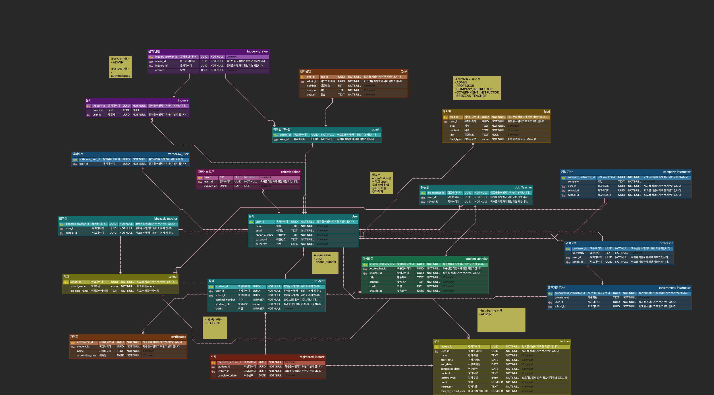
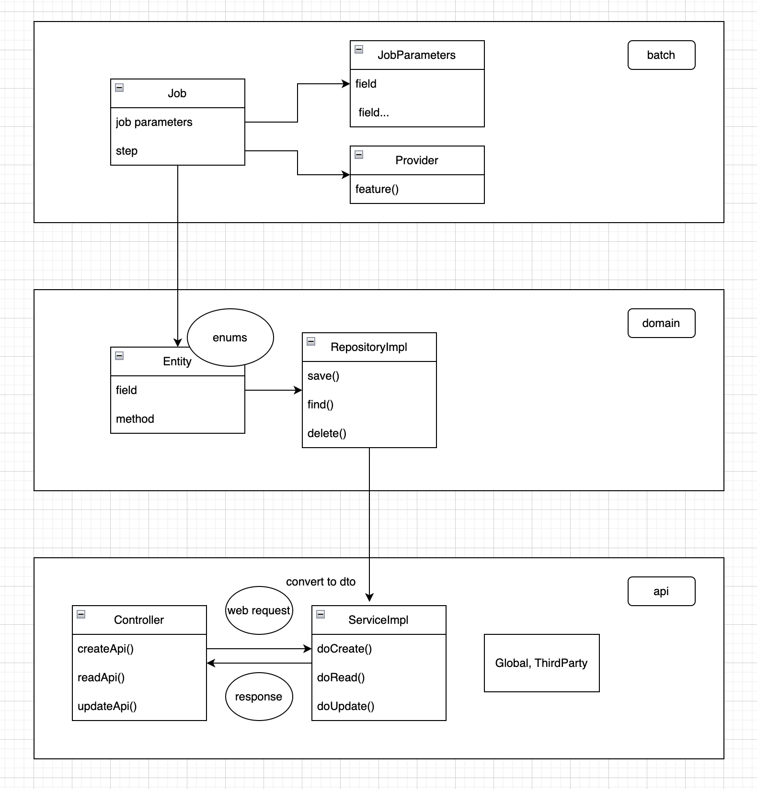

# 빛고을 직업교육 혁신지구

저희는 광주소프트웨어마이스터고등학교 2세대 학교기업 팀입니다.  
광주광역시 교육청과 함께 빛고을 직업교육 혁신지구 사업을 추진하고있습니다.

---

## ERD

---

## Class Diagram

--- 

## Commit Message Rule

type | meaning |
--|--
create | 새로운 클래스를 생성했을 때
add | 새로운 기능(메서드를) 추가했을 때
update | 변경사항을 적용했을 때
refactor | 코드를 개선했을 때
fix | 버그, 이슈를 해결했을 때
delete | 삭제한 사항이 생겼을 때
chore | 귀찮은 일 해냈을 때
docs | 문서화 작업을 진행했을 때
test | 테스트 관련 사항이 있을 때